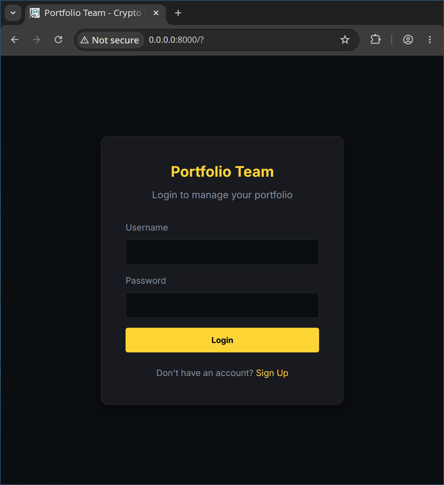
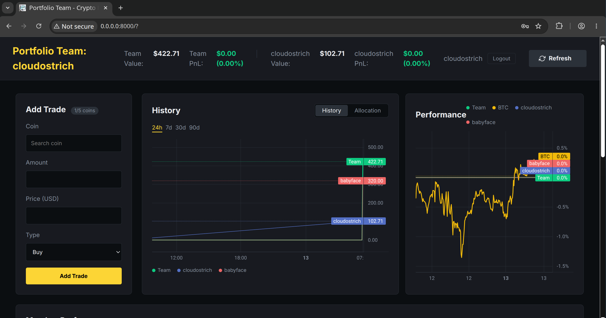
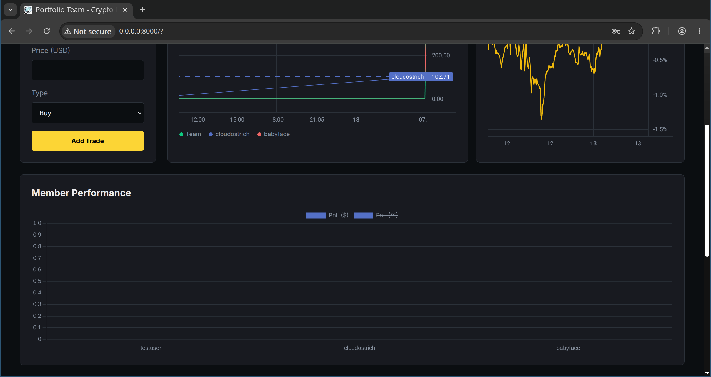
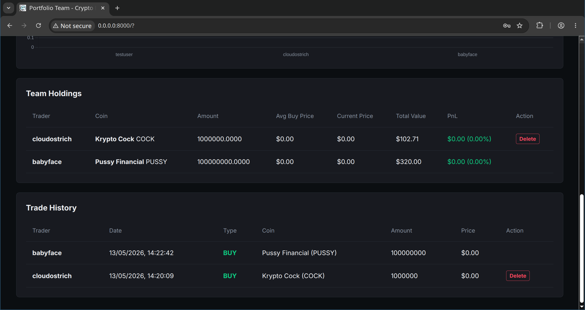

# Portfolio Team (Collaborative Crypto Portfolio)

## Overview
### Inspiration
This project is inspired by the [CoinMarketCap Portfolio Tracker](https://coinmarketcap.com/portfolio-tracker/). We aimed to capture its intuitive design and seamless tracking experience while building a fully localized, private, and collaborative alternative for teams.

### Problem
- **Who is affected?**: Small crypto investment teams, study groups, or trading clubs who want a shared way to track their collective and individual performance.
- **What is the issue?**: Most crypto trackers are for solo use. Teams have to use messy spreadsheets to see how everyone is doing together, leading to data entry errors and a lack of real-time visibility into the team's total health.

### Outcome
- **What was achieved?**:

| Objective | Solution | Result |
| :--- | :--- | :--- |
| Shared team performance tracking | Multi-user login and dashboard with aggregate stats | Success |
| Real-time price updates for all members | Automated live price updates from CoinGecko | Success |
| Efficient analytical data storage | Secure, high-speed local database to store team trades | Success |
| High-performance charting | TradingView & Chart.js for team visuals | Success |

- **Measurable results (if any)**: 
  
  | Metric / Feature | Manual Process | Portfolio Team Result |
  | :--- | :--- | :--- |
  | **Team Data Sharing** | Fragmented, error-prone spreadsheets | **Unified** (Multi-user aggregate database) |
  | **User Experience** | Complex data entry | **Seamless** (Collaborative Dashboard) |
  | **Portfolio Analytics** | Delayed manual calculations | **Instant** (Real-time team performance) |
  | **Price Updates** | Seconds/minutes to manually lookup | **< 1.0 seconds** (via automated CoinGecko API) |

---

## Demo
Our solution makes tracking crypto as a team simple and visual:
1.  **Join the Team:** Register your account and log in to your personal dashboard.
2.  **Add Your Picks:** Search for a coin (like Bitcoin), enter your trade details, and save. You have 5 slots to showcase your best ideas!
3.  **See the Big Picture:** The main screen automatically shows the team's total value and overall profit/loss.
4.  **Compare & Contrast:** Use the interactive charts to see who's leading the pack or how the team's balance has changed over time.

| Welcome Screen | Team Dashboard |
| :--- | :--- |
|  |  |

| Performance Trends | Detailed Tables |
| :--- | :--- |
|  |  |

---

## Technology Stack
### Frontend components:
- **HTML/CSS/JS**: The core building blocks used to create a clean, responsive team dashboard with dark-mode aesthetics.
- **TradingView Lightweight Charts**: Used to visualize team-wide performance history with professional-grade interactive graphs.
- **Chart.js**: Powering the categorical visualizations, such as asset allocation doughnut charts and member performance bar charts.

### Backend components:
- **Python & FastAPI**: The high-performance "brain" that securely manages user logins, processes team trades, and handles all the behind-the-scenes math.
- **DuckDB**: A lightning-fast, simple database that lives directly on your computer to securely save your team's trade history without needing a complex server.
- **CoinGecko API**: Our connection to the internet's live cryptocurrency markets, ensuring the team's dashboard always displays accurate, up-to-the-second prices.

---

## Development Approach with AI
- **List of AI tools, services, models, and their purposes**:
  - **Antigravity (Gemini 3.1 Pro)**: Our primary AI partner for architecting the collaborative multi-user system, handling backend database migrations, and polishing the frontend UI.
- **List of AI agents, including roles and skills**:
  - **Antigravity Agent**: Acted as a fullstack lead developer, managing everything from secure JWT authentication logic to complex analytical SQL queries in DuckDB.
- **List of key prompts used**:
  - "Migrate the solo portfolio dashboard to a collaborative multi-user platform tracking aggregate team holdings."
  - "Enforce a per-member coin limit (maximum 5 coins) to encourage focused team investing."
  - "Implement a visual layout with side-by-side bar charts and multi-series line charts for team member comparison."
- **List of key review points and the corresponding decision made**:
  - *Review Point*: How to handle shared vs. individual views? *Decision*: We prioritized a "Team First" dashboard that shows aggregate totals at the top, with individual member contributions clearly visible in the charts and tables for transparency.
  - *Review Point*: How to ensure secure access? *Decision*: We implemented a strict JWT-based authentication flow, ensuring that while the dashboard is collaborative, every trade is tied to a verified user account.

---

## Installation
Steps to download and set up the project on your computer:
```bash
# 1. Download the team project code
git clone https://github.com/cloudostrich/cryptoportfolio_team.git
# 2. Open the project folder
cd cryptoportfolio_team
# 3. Create a clean workspace for Python
python3 -m venv .venv
```

Steps to run the project for the first time:

```bash
# 1. Turn on your Python workspace
source .venv/bin/activate

# 2. Install all the necessary tools
pip install -r requirements.txt

# 3. Set up your secret passwords and settings
cp .env.example .env
# Open the new .env file in a text editor and add your CoinGecko API key

# 4. Set up the local database to save your team's trades
python -m src.backend.db.init_db
```

---

## Usage

### Starting the Application
How to start and use the application:

```bash
source .venv/bin/activate

# Start the collaborative backend server
uvicorn src.backend.main:app --reload --host 0.0.0.0 --port 8000
```
- Open `http://localhost:8000` in your web browser.
- Register a new account or log in to join the team dashboard.
- Search for coins, log your trades, and watch the aggregate team statistics update in real-time.
- *For advanced users*: All API endpoints (the hidden messengers fetching your data) are available to review and interact with at `http://localhost:8000/docs`. Since we are using FastAPI, the technical details of generating this documentation are automatically taken care of for us behind the scenes.

### Testing

To ensure the application is functioning correctly, you can run the automated test suite.

**1. Run the Full Test Suite:**
This runs all automated tests for the backend logic and API routes without making any live external requests.
```bash
source .venv/bin/activate
pytest tests/ -v
```

**2. Run the Live CoinGecko API Speed Tests:**
This specifically tests the connection to the live CoinGecko API to ensure correct data retrieval and measures the response speed.
```bash
source .venv/bin/activate
pytest tests/test_coingecko_live.py -v -s
```

---

## Project Structure
- `.agents/`: Stores prompts and memory used by the AI agent to manage the collaborative codebase.
- `assets/`: Directory for screenshots and media showing the team dashboard in action.
- `docs/`: Collection of external guides and project requirements (like the B1 Builders Programme specs).
- `src/backend/`: The hidden "brain" of the app that manages user logins, calculates profits, and securely saves the data.
- `src/frontend/`: The visual parts of the app that you interact with in your browser (the design, charts, and buttons).
- `data/`: The secure folder right on your computer where your team's trade history is safely saved.
- `tests/`: Automated checks ensuring the team tracker stays reliable for everyone.

---

## Reflection
- **What worked**: Integrating DuckDB allowed us to run lightning-fast analytical queries on shared team data. The per-member coin limit successfully turned the tracker into a strategic tool rather than just a simple list.
- **What failed**: Our initial transition to a multi-user system had a bug where charts would try to load before the user was fully identified, causing empty graphs.
- **Changes made**: We refactored the frontend to strictly wait for the "Who am I?" check before loading any portfolio data.
- **Rationale**: This ensures a secure, smooth experience where every member sees the team's status accurately as soon as they log in.


